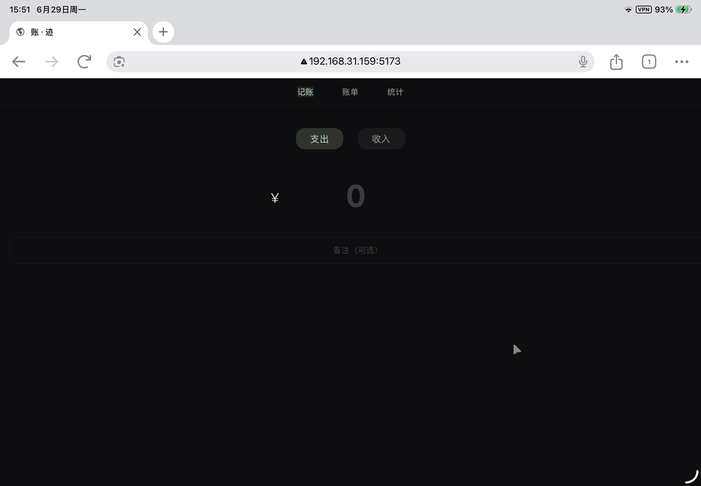
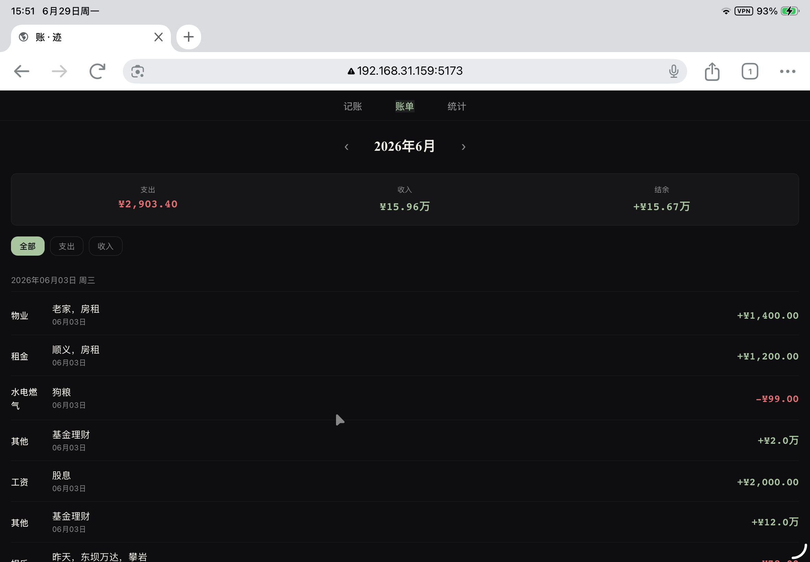
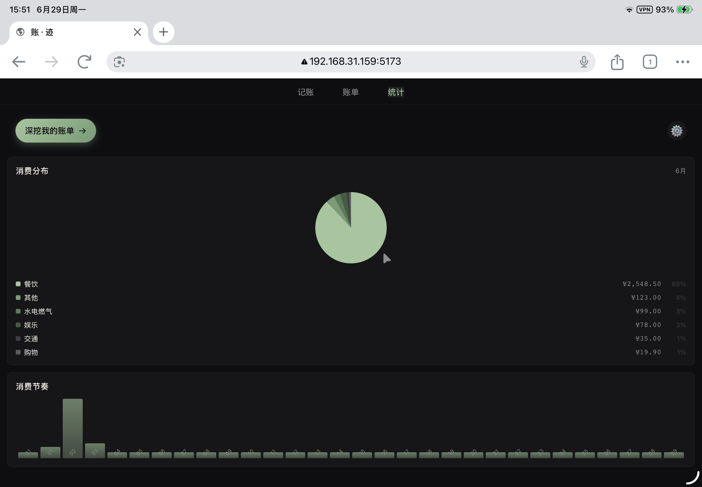
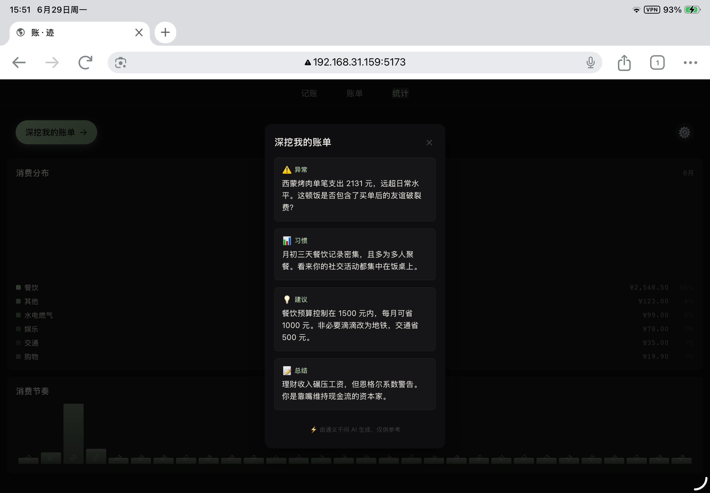

# LedgerAI - 极简单账应用

> 📱 本地优先 · 隐私安全 · AI 增强

LedgerAI 是一款极简风格个人记账应用，采用 **local-first（本地优先）** 架构，所有数据存储在用户设备本地，支持 AI 智能记账和财务分析功能。

**🌐 在线体验**: [https://yourusername.github.io/LedgerAI/](https://yourusername.github.io/LedgerAI/)

---

## 📸 应用预览

| 记账页面 | 账单列表 |
|:--------:|:--------:|
|  |  |
| 极简记账输入界面 | 月度流水与概览 |

| 统计分析 | AI 深度分析 |
|:--------:|:--------:|
|  |  |
| 消费分布与节奏图表 | AI 智能财务分析报告 |

---

## ✨ 核心特点

### 🔒 隐私安全
- **零数据收集**：应用不会收集、上传或存储任何用户个人信息
- **本地存储**：所有账单数据使用 `localStorage` 存储在用户设备本地
- **BYOK 模式**：AI 功能需要用户自行配置 API Key，密钥仅保存在用户设备本地

### 🤖 AI 增强功能
- **AI 智能记账**：输入自然语言（如"昨天中午吃火锅花了 188 元"），AI 自动提取金额、分类、日期
- **即时财务点评**：每笔消费后获得 AI 理性分析和实用建议
- **月度深度分析**：生成包含消费异常、习惯发现、节流建议的完整报告

### 📱 跨平台支持
基于 UniApp + Vue 3 + Pinia 构建，支持多平台：

**✅ 已实现**
- H5 网页（哈希路由模式）

**🔜 支持但未构建**
- 微信小程序（mp-weixin）
- 支付宝小程序（mp-alipay）
- 百度小程序（mp-baidu）
- 头条小程序（mp-toutiao）
- iOS / Android App（app-plus）

---

## 🚀 快速开始

### 环境要求
- Node.js 18+
- pnpm（推荐）或 npm

### 安装依赖
```bash
pnpm install
```

### 开发模式
```bash
# H5 开发
pnpm dev:h5

# 微信小程序开发
pnpm dev:mp-weixin

# 其他平台
pnpm dev:mp-alipay    # 支付宝小程序
pnpm dev:mp-toutiao   # 头条小程序
```

### 构建生产版本
```bash
# H5 构建
pnpm build:h5

# 微信小程序构建
pnpm build:mp-weixin
```

### 🌐 GitHub Pages 部署

项目已配置 GitHub Actions 自动部署工作流：

1. **推送代码到 main 分支**
   ```bash
   git add .
   git commit -m "Your changes"
   git push origin main
   ```

2. **GitHub Actions 自动构建部署**
   - 每次推送到 main 分支会自动触发构建
   - 也可手动在 GitHub Actions 页面触发 "Deploy to GitHub Pages"

3. **访问部署后的网站**
   ```
   https://YOUR_USERNAME.github.io/LedgerAI/
   ```

> 📝 **首次使用**: 需要在 GitHub 仓库 Settings → Pages 中，将 Source 设置为 "GitHub Actions"

详见 [DEPLOY.md](DEPLOY.md) 完整部署指南。

---

## 📂 项目结构

```
LedgerAI/
├── src/
│   ├── pages/              # 页面组件
│   │   ├── tabbar/         # 底部导航页
│   │   ├── record/         # 记账页面
│   │   ├── bills/          # 账单列表
│   │   ├── stats/          # 统计页面
│   │   └── settings/       # 设置页面（含 AI 配置）
│   ├── store/              # Pinia 状态管理
│   │   ├── bills.js        # 账单数据（localStorage 持久化）
│   │   └── config.ts       # 应用配置（AI 配置等）
│   ├── utils/              # 工具函数
│   │   ├── ai-ledger.js    # AI 记账核心逻辑
│   │   ├── ai-config.js    # AI 配置管理
│   │   ├── format.js       # 格式化函数
│   │   └── categories.js   # 分类定义
│   ├── components/         # 公共组件
│   └── static/             # 静态资源
├── dist/                   # 构建输出目录
└── package.json
```

---

## 🔐 数据存储说明

### 本地存储内容
| 存储键 | 内容 | 说明 |
|--------|------|------|
| `ledger_bills` | 账单数据 | 所有收支记录，JSON 格式 |
| `ledger-config` | 应用配置 | AI 配置、主题、语言等 |

### 网络请求说明
- **基础记账功能**：完全离线运行，无需联网
- **AI 功能**：仅在用户启用 AI 并配置 API Key 后，才会向用户指定的 AI 服务商发送请求
- **AI 请求内容**：仅发送当前账单数据或分析请求，不发送任何个人身份信息

---

## ⚙️ AI 功能配置

AI 功能为可选增强功能，用户可在设置页面自行配置：

1. **启用 AI**：开关控制
2. **API Base URL**：AI 服务商接口地址（如 `https://dashscope.aliyuncs.com/compatible-mode/v1/chat/completions`）
3. **API Key**：用户自行申请的 API 密钥（以 `sk-` 开头）
4. **模型选择**：选择使用的 AI 模型（如 `qwen-plus`）

> 💡 提示：AI 配置保存在本地，可随时修改或删除。删除配置后 AI 功能自动禁用。

---

## 🎨 UI 设计理念

- **Apple 极简风格**：干净、克制的界面设计
- **流式交互**：自动保存，无需手动点击保存按钮
- **Toast 反馈**：操作后 1.5 秒轻量提示（如"✓ 已保存"）
- **深色模式优先**：默认深色主题，支持跟随系统

---

## 📝 技术栈

| 技术 | 版本 | 用途 |
|------|------|------|
| Vue 3 | 3.4.21 | 核心框架 |
| Pinia | 3.0.4 | 状态管理 |
| UniApp | 3.0.0 | 跨平台框架 |
| TypeScript | 4.9.4 | 类型支持 |
| UnoCSS | 66.7.0 | 原子化 CSS |
| Vite | 5.2.8 | 构建工具 |

---

## 📄 许可证

MIT License

---

## ⚠️ 重要声明

1. **本项目不会收集、存储或上传任何用户数据**
2. **所有账单数据存储在用户设备本地（localStorage）**
3. **AI 功能需要用户自行配置 API Key，密钥仅保存在用户设备**
4. **清除浏览器缓存或卸载应用会导致本地数据丢失，请定期备份**
5. **AI 分析功能需要联网，但仅向用户配置的 AI 服务商发送请求**

---

## 🙏 致谢

- [UniApp](https://uniapp.dcloud.net.cn/) - 跨平台开发框架
- [Vue 3](https://vuejs.org/) - 渐进式 JavaScript 框架
- [Pinia](https://pinia.vuejs.org/) - Vue 官方状态管理库
